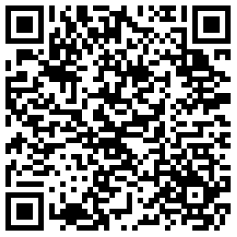
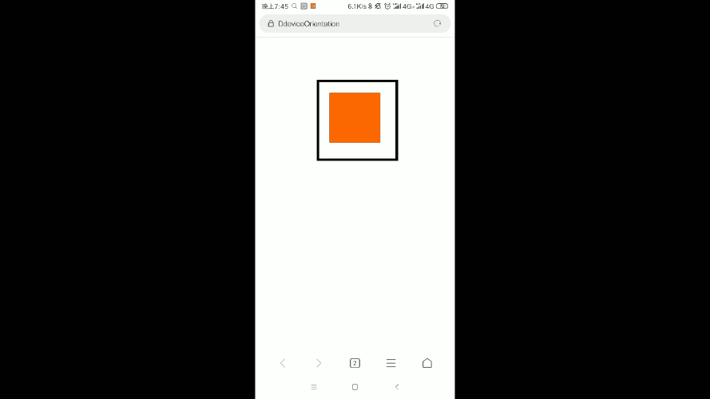

# deviceOrientation
基于deviceOrientation实现手机改变角度视觉滚动
手机演示：

![二维码]
(http://note.youdao.com/yws/res/542/WEBRESOURCE538876bcc90a65e31a98b6bf128f6883)

使用手机重力感应器，通过h5的api进行调用DeviceOrientationEvent，这是一个事件，翻译过来就是设备方向事件。
```
// 通过监听设备方向改变事件deviceorientation来触发DeviceOrientationHandler，事件句柄在捕获阶段执行
if (window.DeviceOrientationEvent) {
    window.addEventListener('deviceorientation', DeviceOrientationHandler, true);
} else {
    alert("您的浏览器不支持DeviceOrientation");
}
```
方向事件对象中包含四个值：[MDN网址](https://developer.mozilla.org/zh-CN/docs/Web/API/Detecting_device_orientation)

* DeviceOrientationEvent.absolute （感觉没什么卵用） bool类型，表示该设备是否提供绝对定位数据 (这个数据是关于地球的坐标系) 或者使用了由设备决定的专门的坐标系
* DeviceOrientationEvent.alpha 表示设备沿z轴上的旋转角度，范围为0~360。
* DeviceOrientationEvent.beta 表示设备在x轴上的旋转角度，范围为-180~180。它描述的是设备由前向后旋转的情况。
* DeviceOrientationEvent.gamma 表示设备在y轴上的旋转角度，范围为-90~90。它描述的是设备由左向右旋转的情况。

那么，我们有了手机设备在各个方向倾斜的角度数据，我们要实现的是根据手机倾斜角度的改变来改变网页内容的相对位置进而模拟3d视角的效果。

```
function DeviceOrientationHandler(event) {
    var alpha = event.alpha,
        beta = event.beta,
        gamma = event.gamma,

        dataContainerOrientation = document.getElementById("msg")

    if (alpha != null || beta != null || gamma != null) {

        var box = document.getElementById('box');
        var box2 = document.getElementById('box-outer');

        //演示效果粗略实现，用css3 3D 改变舞台角度来实现效果也是不错的选择

        // 设置内外方框随手机倾斜角度的进行差异化的偏移
        box.style.marginLeft = parseInt(gamma / 2) - 50 + 'px';
        box.style.marginTop = parseInt(beta / 2) + 100 + 'px';
        box2.style.marginTop = parseInt(beta / 3) + 75 + 'px';
        box2.style.marginLeft = parseInt(gamma / 3) - 75 + 'px';


    } else {
        dataContainerOrientation.innerHTML = "当前浏览器不支持DeviceOrientation";
    }
}  
```
> 预览二维码




> 鸣谢：yilian_develope  
> 参考： https://blog.csdn.net/yilian_develope/article/details/52753904
